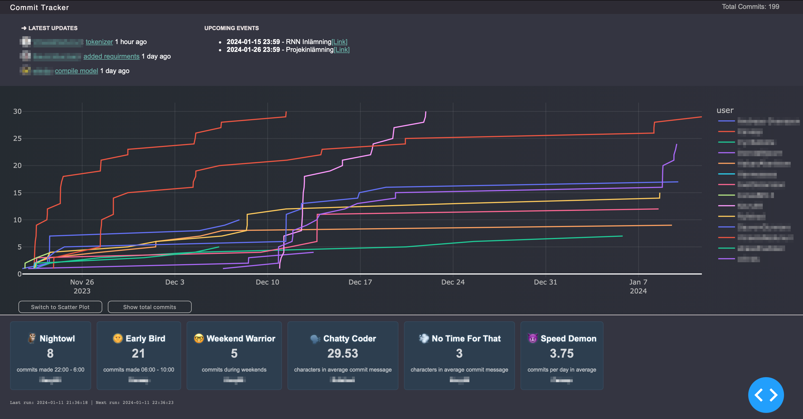

## GitHub Stats - Commit Tracker Dashboard

GitHub Stats is a versatile Commit Tracker Dashboard that allows you to effortlessly monitor and analyze commit activities in multiple GitHub repositories. Whether you're managing a project, collaborating with a team, or just curious about a specific repository's development, GitHub Stats provides insightful visualizations and detailed statistics to keep you informed.

### Features

- **Real-time Commit Monitoring:** Stay up-to-date with the latest commits in real-time, ensuring you are always in the loop about projects progress.

- **Comprehensive Statistics:** Gain valuable insights into commit history and commit frequency.

- **User-friendly Interface:** The intuitive and user-friendly interface makes it easy for both developers and non-technical users to navigate and understand the commit data.

- **Customizable Dashboards:** Tailor the dashboard to suit your needs by selecting specific time ranges or contributors. #TODO add custom css themes

- **Easy Integration:** GitHub Stats seamlessly integrates with your GitHub repositories, requiring nothing but an API key.
